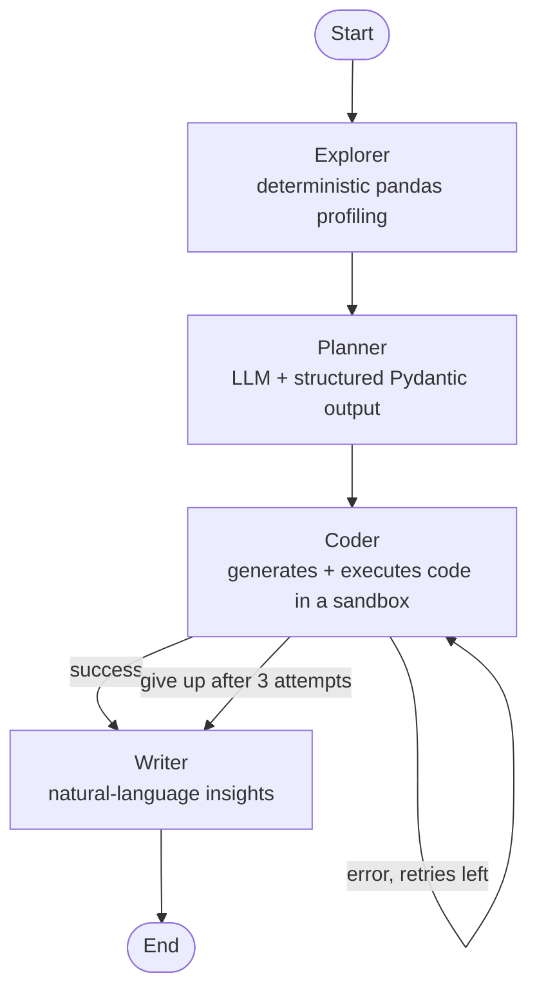

# Multi-Agent Data Analyst

> Upload a CSV, and a system of **4 AI agents** collaborates to analyze it automatically: data exploration, analysis planning, Python code generation **and execution**, then natural-language insights.

Built with **LangGraph**, this project goes beyond a simple "call an LLM" wrapper: it implements real multi-agent orchestration with shared state, structured output, a **self-correction loop**, and **sandboxed code execution** whose security trade-offs are deliberate and documented.

---

## What it does

Given any CSV file, the system:

1. **inspects** the data (columns, types, missing values, statistics);
2. **decides** which analyses and visualizations are relevant;
3. **writes Python code** (pandas + Plotly), **executes it**, and **fixes itself** if the code fails;
4. **interprets** the resulting charts and **writes** readable insights.

Everything is driven through a **Streamlit** web interface: upload a CSV, click run, and get interactive charts alongside a written analysis.

The system is **data-agnostic**: no column name is hard-coded. It adapts to the structure it *discovers*, so it works on datasets other than the one used during development.

---

## Architecture

Four agents collaborate through a **shared state** (a common "whiteboard"). Agents never call each other directly: each reads what it needs from the state and writes its own contribution back. This decoupling makes every agent independently testable and replaceable.



| Agent | Role | Tool | Why this choice |
|-------|------|------|-----------------|
| **Explorer** | Profiles the dataset (facts) | pandas, **deterministic** | Counting rows or detecting types are *facts*: compute them exactly, don't ask an LLM (hallucination risk). |
| **Planner** | Decides the analyses | LLM + **structured output** | Its output feeds the Coder → enforce a Pydantic schema (a machine *contract*), not free text. |
| **Coder** | Generates and runs the code | LLM + **sandbox** + **retry loop** | Its output must actually *run*: isolated execution, plus self-correction on error (see below). |
| **Writer** | Writes the insights | LLM, **free text** | Its deliverable is prose for a human → no schema, and a higher temperature for a natural tone. |

---

## Multi-agent concepts demonstrated

This project was an opportunity to apply concrete agentic-system patterns:

- **Shared state & reducers** — a typed state (`TypedDict`) where each field has an update policy: some *overwrite* (latest result), others *accumulate* (`operator.add`) to keep a memory of past attempts.
- **Structured output as a contract between agents** — when one agent feeds another, a Pydantic schema is enforced; when it produces for a human, free text is allowed.
- **Self-correction loop (conditional edge)** — after the Coder, a routing function inspects the state: on error, the **failed code + error message** are sent back to the Coder so it can fix itself, bounded by a counter (`MAX_CODE_ATTEMPTS`).
- **Anti-hallucination grounding** — the Explorer establishes the facts; the LLM agents reason over them without inventing, and outputs are *verified* (filtering out any non-existent columns proposed by the Planner) rather than trusted blindly.
- **Engine / interface separation** — the LangGraph graph is a reusable engine; Streamlit is just a façade on top of it.

---

## Security: executing LLM-generated code

This is the trickiest — and most interesting — part of the project. Running code written by an LLM is dangerous. The chosen approach is deliberately **honest about both its guarantees and its limits**.

**Assumed threat model:** **local** use, on user-provided data, with a non-adversarial LLM. The main risk is therefore not malicious code, but **buggy** code (wrong column, infinite loop…).

**Isolation in place** (via `subprocess`):

| Threat | Protected? | How |
|--------|:---------:|-----|
| Code crashes the application | ✅ | Runs in a **separate process** |
| Code loops forever | ✅ | **Timeout** on the subprocess |
| Code reads the API key (`OPENAI_API_KEY`) | ✅ | **Minimal environment**: no secrets passed to the child process |
| Code writes/deletes files | ❌ | *Not protected* — subprocess inherits the user's permissions |
| Code accesses the network | ❌ | *Not protected* |

**`subprocess` reduces the blast radius, but is not a true sandbox.** The last two rows would require strong isolation (Docker / gVisor / a cloud sandbox such as E2B or Modal).

---

##  Tech stack

- **Orchestration:** LangGraph (shared state, nodes, conditional edges)
- **LLM:** OpenAI (`gpt-4.1-mini`) via `langchain-openai`, with Pydantic structured output
- **Data & visualization:** pandas, Plotly
- **Interface:** Streamlit
- **Python:** 3.12

---

## 📁 Project structure

```
data-analyst-agents/
├── app.py            # Streamlit interface (upload, run, display)
├── graph.py          # LangGraph graph construction + conditional routing
├── state.py          # Shared-state definition (TypedDict + reducers)
├── config.py         # Centralized configuration (API key, model, constants)
├── data_io.py        # CSV loading and validation
├── explorer.py       # Explorer agent (pandas profiling)
├── planner.py        # Planner agent (LLM + Pydantic schema)
├── coder.py          # Coder agent (generation + execution + self-correction)
├── safe_execute.py   # Isolated execution sandbox (subprocess + timeout)
├── writer.py         # Writer agent (interpretation + writing)
├── requirements.txt
└── .env              # API key (not committed)
```

---

## 🚀 Setup & run

**Requirements:** Python 3.12 and an OpenAI API key.

```bash
# 1. Clone the repo
git clone https://github.com/<your-user>/data-analyst-agents.git
cd data-analyst-agents

# 2. Create the virtual environment and install dependencies
python3.12 -m venv venv
source venv/bin/activate          # Windows: venv\Scripts\activate
pip install -r requirements.txt

# 3. Configure the API key
echo "OPENAI_API_KEY=sk-..." > .env

# 4. Launch the app
streamlit run app.py
```

The app opens at `http://localhost:8501`. Upload a CSV and click **"Run analysis"**.

> 💡 Recommended test dataset: the **Superstore Dataset** (Kaggle). Put the CSV anywhere — the upload happens from the interface.

---

## Demo

